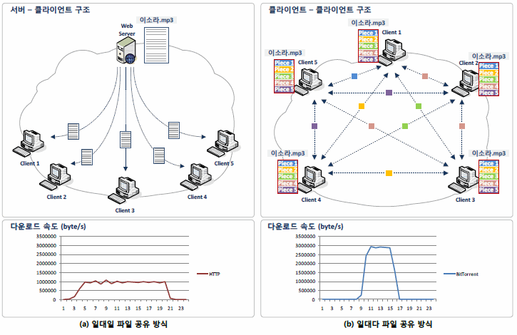

# IPFS의 등장 배경

IPFS는 분산형 파일 시스템에 데이터를 저장하고 인터넷으로 공유하기 위한 프로토콜이다.

조금 더 구체적으로 접근하면, 탈중앙화, 개인간(P2P), 무신뢰 방식으로 모든 종류의 파일을 저장하는 데 사용되는 블록체인 네트워크이다.

인터넷은 연결이며, HTTP 프로토콜은 서로 데이터를 주고 받는 방식에 대한 약속이다.

Web은 인터넷 상에서 HTTP 프로토콜에 따라 주고 받는 공간이다.

일상적으로 우리는 인터넷과 웹을 동의어처럼 사용하지만, 엄밀하게 말하면 다르다.

인터넷은 방대한 네트워크, 혹은 네트워크 인프라를 의미한다.

인터넷이 연결되어 있다면, 컴퓨터는 다른 컴퓨터와 통신이 가능하다.

웹은 인터넷을 통해 데이터를 얻는 방법 중 하나에 지나지 않는다.

웹은 인터넷 계층 위에 설계된, HTTP 프로토콜을 사용하는 데이터공유 모델이다.

기존 HTTP Web은 불안정적이고, 중앙화 되어있으며, 비효율적이고, 느리며, 고도의 연결성을 필요로 한다.

IPFS는 이러한 Web의 문제점들을 해결하고 모든 컴퓨터를 연결하고자 하는 분산된 P2P 파일 시스템이다.

InterPlanetary(행성 간의)라는 표현이 사용된 이유는 뭐... 다른 행성의 컴퓨터까지 연결하겠다는 비전이라고 한다.

IPFS Web에서는 파일을 데이터, 정보, 컨텐츠의 개념으로 보면 된다.

---

## IPFS 특징

- 중앙화된 서버 없이 노드들의 P2P 통신으로 실현한 더 빠르고 안전하고 열린 네트워크이다.
  - 대형 서버의 연결이 차단되면 치명적인 HTTP Web과는 달리, 몇몇 노드들 연결이 끊어져도 생태계가 유지된다.
- 고용량파일을 빠르고 효율적으로 전달할 수 있으며, 파일들의 중복을 알 수 있기 떄문에 저장소도 효율적으로 사용할 수 있다.
- IPFS 상에 업로드된 파일의 이름은 영원히 기록되며, 만약 IPFS 상에서 지키고 싶은 파일은 원하는 만큼 지켜낼 수 있다.
  - 파일의 버전관리(Git)가 가능하다.

---

## IPFS 원리

각각의 파일은 여러 개의 블록으로 이루어져 있으며, 각각의 블록은 해시로 표현된 고유의 이름이 있다.

IPFS는 모든 파일의 이름을 데이터베이스 속에 저장하며, 동일 파일의 중복을 배제하고, 각 파일의 버전 정보를 트래킹한다.

각 노드는 본인이 관심있는 파일만 저장소에 보관하며, 인덱싱 정보를 통해 누가 어떤 파일을 저장하고 있는지 알 수 있다.

네트워크에서 파일을 찾기 위해서는, 파일명을 조회하고 해당 파일을 갖고 있는 노드를 물어보면 된다.

모든 파일명은 읽기 쉬운 형태로 변환 가능하다.

---

## IPFS를 구성하는 기술

IPFS Web은 다양한 기술들의 조합으로 이루어져 있다.

### Distributed Hash Tables(DHT)

네트워크에 참여한 노드들이 해시 테이블을 각자 관리함으로써 중앙화된 서버 없이

고도의 P2P 네트워크를 실현할 수 있으며, 이를 분산 해시 테이블 기술(DHT)이라고 말한다.

어떤 방시긍로 DHT를 운영하느냐에 따라서 얼마나 빠르고 효율적으로 네트워크 요청을 소화해낼 수 있는지 그 역량이 결정되며,

노드의 네트워크 진입/이탈, 신규 컨텐츠 등록 등이 어떻게 관리되는 지 달라진다.

DHT의 등장으로 수십억개의 노드를 운용해도 네트워크의 부하를 억제할 수 있다고 한다.

기존의 HTTP에서는 컨텐츠의 위치(IP)를 알고 찾아갔으나, 사라진 주소(IP)거나 컨텐츠가 없으면 에러를 겪곤 했다.

IPFS에서는 컨텐츠 자체를 찾는다. 컨텐츠 자체가 주소의 역할을 하는데, 이를 *content-addressed*라고 한다.

| Index    | Node Number   |
| -------- | ------------- |
| 컨텐츠 1 | 노드 1        |
| 컨텐츠 2 | 노드3, 노드 5 |
| 컨텐츠 3 | 노드2, 노드 9 |

해시테이블 상에서 컨텐츠 이름을 찾으면 해당 컨텐츠를 보유하고 있는 노드를 알 수 있다 !

 

### Bittorrent

Bittorrent는 P2P 파일 교환 프로토콜이다. 종전의 방식은 서버가 파일을 가지고 있고, 클라이언트가 받아가는 형태였다. 

반연 Bittorrent는 하나의 파일을 여러 조각으로 나누어서, 

각 노드끼리 자신이 갖고 있는 조각의 정보를알려주고 다른 노드들에게 자신이 필요한 조각을 요청한다. 

다른 노드들과 많은 세션을 생성하게 되며, 세션이 늘어남에 따라 사용자의 다운로드 속도는 전적으로 늘어나,

노드가 사용하는 인터넷 환경의 최대 대역폭까지 다운로드 속도가 증가한다. 

 

### IPFS BitSwap Protocol

BitSwap은 BitTorrent에서 영감을 얻은 프로토콜이다. 

Peer들은 본인이 얻고 싶은 파일 블록과 본인이 갖고 있는 파일 블록이 있다. 

BitTorrent에서는 하나의 파일을 받고자 할 때 그 파일의 블록들만 한정적으로 받아올 수 있는 반면,

BitSwap에서는 일치하는 파일 블록이라면 어떤 파일에 속해 있든지 받아올 수 있다고 한다. (???) 

노드들이 받기만 하려고 하고 줄 생각이 없다면 문제가 되기 때문에, BitSwap은 기본적으로 물물교환 시스템을 표방한다. 

무언가를 받기 위해서는 무언가를 주어아 하고, 대가로 줄 파일을 얻기 위해서 파일 블록들을 더 배포, 확산시키는 시스템이다.

이것은 **Filecoin 구상이 시작된 배경이기도 하다.**

BitSwap Credit 시스템을 통해 노드들이 peer에게 파일을 보내주면 보낸 노드는 자산이 증가하며, 받은 노드는 부채가 증가한다. 

이로써 받기만 하려고 하는 어뷰징을 막을 수 있고, 파일 블록을 보유하고 보내주는 것에 인센티브가 생기게 된다. 

---

## Source 

[IPFS(InterPlanetary File System)이해하기 1부 : HTTP Web을 넘어서, IPFS Web으로](https://medium.com/@kblockresearch/8-ipfs-interplanetary-file-system-%EC%9D%B4%ED%95%B4%ED%95%98%EA%B8%B0-1%EB%B6%80-http-web%EC%9D%84-%EB%84%98%EC%96%B4%EC%84%9C-ipfs-web%EC%9C%BC%EB%A1%9C-46382a2a6539)

[IPFS란 무엇인가: 웹의 미래](https://phemex.com/ko/academy/what-is-ipfs)

