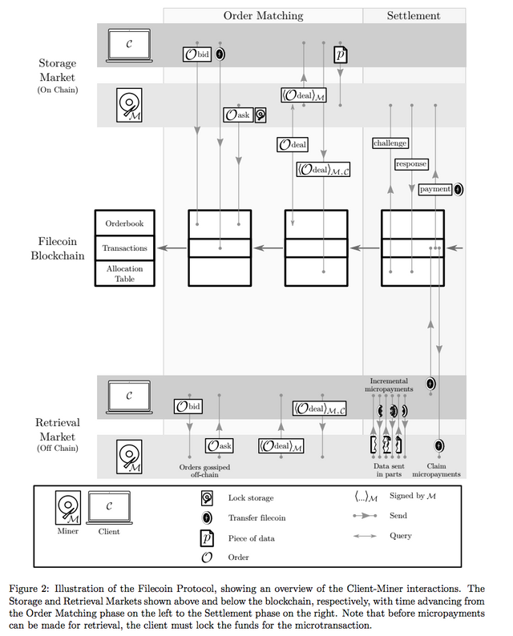

# IPFS and Filcoin

IPFS는 탈중앙화 웹이다. 하나의 서버가 다운되거나 파괴되더라도 우리는 파일을 잃지 않는다. 

블록체인을 통해 탈중앙화된 토큰 economy를 구상할 때, IPFS는 파일 저장 및 보관의 측면에서도 탈중앙화를 실현할 수 있다.

IPFS를 통해 우리는 모든 파일을 블록체인 상에 올릴 수 있다. 

그러나 이것이 해당 파일을 직접 블록체인에 올린다는 의미는 아니다.

우리가 2GB 용량의 파일을 올린다면, 엄청난 양의 GAS를 소모하게 될 것이다. 

IPFS 네트워크에 해당 파일을 업로드(Merkle DAG==Git에 해당 파일을 추가)하면, 파일 고유의 해시값이 산출된다. 

이제 이 해시값은 IPFS상에서 해당 파일의 영구적인 이름이 된다. 

Content-Addressing으로 해당 파일을 찾을 때 이 해시를 이용하게 될 것이다.

이는 영구적인 링크와 같으므로, 변조의 위험이 없다. 

---

## IPFS를 사용하는 시나리오

### Scenario 1

* 해당 파일에 대한 저작권을 등록하고 싶다.
* 내가 만들었음을 증명하기 위해 블록체인에 기록하려고 한다.
* 해당 파일의 해시값을 등록한다.

### Scenario 2

* 송금을 하면 어떤 파일을 지급하는 스마트 컨트랙트를 만들었다.
* 파일 용량이 너무 커서 스마트 컨트랙트 자체에 파일을 넣어둘 수는 없다. 
* IPFS 상에서 해당 파일을 암호화하여 키를 갖고 있는 사람만 열람할 수 있도록 한다. 
  * 해시값을 가진 사람만이 content-address로 접근해 열람이 가능할 것.
* 스마트 컨트랙트에서는 해당 파일의 해시값과 복호화 키를 담아놓는다. 
* 송금한 사람은 해시값과 복호화 키를 가지고 IPFS 상에서 파일을 수령할 수 있다. 

---

## IPFS와 파일코인 

파일코인은 IPFS의 인센티브 레이어이다. 

IPFS 웹이 원활하게 운영되기 위해서는 노드들이 파일을 저장하고, 

해당 파일을 원하는 노드에게 파일을 제공해주어야 하낟. 

그러나 모든 노드들이 파일을 받기만 하려 한다면 IPFS 웹은 실현될 수 없을 것이다.

또한 여러 노드가 파일을 저장해야 더욱 안전하고, 쉽고 빠르게 공유할 수 있다. 

따라서 IPFS 개발진은 파일코인이라는 토큰을 기반으로 시장을 형성하여, IPFS 웹 발전에 기여할수록 보상 받는 구조를 만들었다. 

파일코인에는 두 가지 시장이 존재한다. 저장소 시장(Storage)과 검색 시장(Retrieval)이 그것이다.

각 시장에는 Miner라고 불리는 일꾼들이 있다.

 

 

저장소 시장에서 클라이언트는 저장소 마이너에게 토큰을 지불하고 파일을 저장할 수 있다.

검색 시장에서 클라이언트는 저장소 마이너에게 토큰을 지불하고 파일을 전달받을 수 있다. 

두 시장 모두 클라이언트와-마이너가 거래하게 되며, 자신의 주문을 설정하거나 가격을 제시할 수 있으며,

상대방의 제안을 승낙할 수 있다. 

Proof-of-Spacetime, 공간 증명 방식은 저장소 마이너가 일을 제대로 수행했음을 증명하는 것을 의미한다. 

즉, 어떤 파일이 일정 기간동안 저장되고 있음을 증명하는 것이다. 

저장소 마이너는 지속적으로 증명을 생성해내고, 불시에 파일코인 블록체인이 증명을 요구할 경우, 증명을 제출해야 한다.

파일코인 블록체인 마이너는 해당 증명을 검증하고, 블록에 기록한다. 

