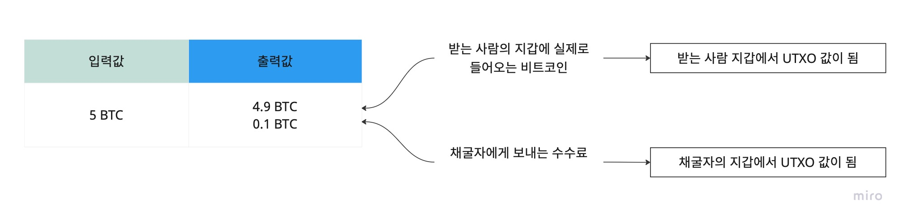
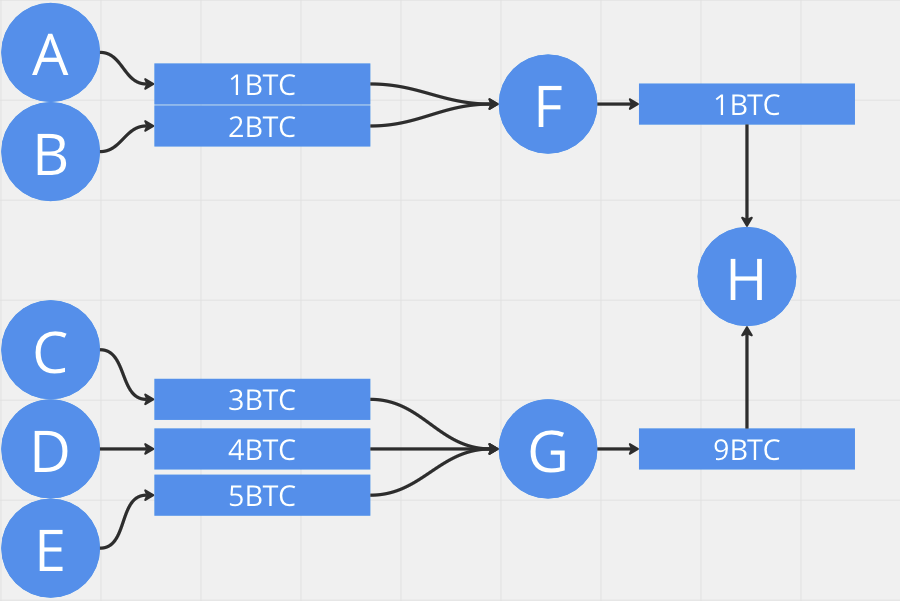

# UTXO & Account

블록체인이라고 해서 모두 같은 방식으로 동작하는 것은 아니다. 

비트코인과 이더리움은 각자의 트랜잭션 처리 방식이 있는데, 비트코인은 UTXO를 사용하고 이더리움은 Account 방식을 채택했다.

---

## UTXO

UTXO 란 Unspent Transaction Output 의 약자로, 아직 쓰지않은 잔액 이라는 의미이다. 

비트코인 네트워크에서는 잔액이라는 개념은 애초에 존재하지 않고, 이더리움과 같은 계정이나 지갑이 없다.

트랜잭션에 의한 결과물들의 합을 잔액이라는 개념으로 사용하는데 이를 UTXO 데이터로 대체한다. 

각 지갑의 UTXO들은 해당 지갑 주인(소유주)에 대해 공개키 암호로 잠겨있다.

이름에서 알 수 있듯이, `Transaction` 과 연관이 있다. A가 C에게 송금하고,B도 C에게 송금하면 UTXO가 2개 생성된다. 

간단한 그림으로 예시를 들면 다음과 같다.

A와 B가 F에게 각각 1BTC, 2BTC를 전송하면 UTXO가 각 1개씩 생성.

C, D, E도 마찬가지로 G에게 송금하면서 각 1개씩 생성한다.

마지막으로 F와 G가 H에게 송금하면서 7개의 UTXO가 생성되었다. 

G가 H에게 9BTC를 보내려고 하게되면 G가 가진 UTXO중 9BTC 이상인 값을 찾는다. 

그러나 G에게는 9BTC 이상인 UTXO가 없고, ERROR가 발생한다.

F는 1BTC를 소유하고 있어 문제없이 송금이 가능하다.

> 작은 UTXO를 더해서 사용할 수 없고, 큰 UTXO를 나누어 사용할 수 없다.

만약 10BTC의 UTXO가 있고, 9BTC를 보내는데 해당 UTXO를 사용한다면 `10UTXO를 소비하고 그 자리에 1UTXO를 생성하게 된다`.

---

## Pros

### 이중 지불 방지

트랜잭션을 발생시키면 해당 UTXO는 검증을 받은 후 TX Pool에 들어간다. 이중지불이 발생하면 채굴자들은 Pool에서 UTXO검사 후 사용 기록이 있다면 해당 거래를 무효화 할 수 있다. 

### 잔고의 증명

UTXO는 추적하기가 용이한 장점이 있다. 즉, 거래에 대한 유효성을 검증하기가 매우 쉽다. 

일반적으로 이더리움 같은 경우는 트랜잭션들을 모두 검증 및 확인하여 최종적으로 잔고를 유추하지만 UTXO는 해당 사용자의 UTXO만 확인하면 되기 때문에 그럴 필요가 없다. 

이더리움처럼 어느 계좌에 귀속이 된 기록이 아니라 흩어져 있는 UTXO의 객체들로 특정 소유자의 계좌를 유추하는 방식이기 때문에 특정 계좌의 잔고를 알기가 힘들 수 있지만, 수많은 애플리케이션들이 이러한 기능들을 모두 제공하고 있어서(특정 사용자의 UTXO를 모아주는 기능)잔고를 확인하는 데 큰 불편함이 없다.

## Cons

1. UTXO의 가장 큰 단점은 UTXO가 너무 과하게 생성이 될 경우이다. 이더리움은 결과적으로 잔고 하나만 확인하면 끝이지만, UTXO 방식을 채용하는 코인은 흩어져 있는 UTXO를 모두 모아야 되며 소액 결제를 엄청 자주 하거나, 채굴로 이자를 받게 되면 과도한 UTXO로 인해서 불필요하게 과도한 수수료를 내야 하는 단점이 생간다.

2. UTXO 모델 기반 블록체인은 프로그래밍 가능성이 약하고 복잡한 계산이 거의 불가능하다. UTXO 모델 기반 블록체인에 대한 복잡한 논리 또는 상태 저장 계약의 구현은 복잡하여 높은 비용과 낮은 상태 공간 활용도를 초래한다.

---

## Account based Model

이더리움은 스마트 계약을 위해 비트코인의 UTXO 방식대신 계정(Account) 방식을 채택하기로 결정했다. 

계정 방식에서 상태는 블록으로 전송되지 않고 로컬로 노드에 저장된다. 노드는 StateRoot(글로벌 상태의 Merkle 루트)를 비교하여 상태에 대한 합의에 도달한다.

UTXO 기반 블록체인과 계정 기반 블록체인의 중요한 차이점 중 하나는 UTXO는 트랜잭션이 결과 상태를 확정 짓는다는 것이다. 

UTXO 기반에서는 트랜잭션을 발생할 때 결과가 어떻게 될지 알고있고, 코인의 위치는 트랜잭션 자체에 포함된다. 

계정 기반 시스템에서는 그렇지 않다. 계정 기반 시스템의 트랜잭션은 기존 상태에 의존하므로 스테이트풀(Stateful)이라고도 한다.

계정 기반 모델은 UTXO와 다르게 코인을 분할하거나 합쳐서 트랜잭션을 발생시킬 수 있다. 

A의 계정의 잔고에 100ETH가 있으면 B한테 5ETH만 보낼 수 있으며 A의 잔고는 95ETH가 남고 트랜잭션에 포함된 값은 5ETH가 된다.

---

### Address, Public Key, and Private Key

#### Address 

이더리움 블록체인에서 사용자의 신분증/이메일에 해당하는 것이 주소이다. 각 주소에 매핑되는 개인키가 있다.

개인키는 사용자만 알고 있는 일종의 암호이고, 블록체인과 상호작용하기 위해서는 주소 * 개인키 쌍이 필요하다.

#### Key

키는 개인키(Private Key)와 공개키(Public Key)로 구분되어 사용된다.

개인키(Private Key)는 무작위로 생성되며 비밀 키로써 유지해야 하는 반면, 

공개키(Public Key)는 개인키를 연산하여 생성되며 계정을 식별하는 요소로 사용된다.

### 주소 생성 과정 

1. 개인키를 생성하고, 개인키로부터 공개키를 생성.
2. Keccak-256 알고리즘으로 공개 키의 해시값을 계산.
3. 생성된 해시값의 뒤쪽 20byte만 남기고 제외후 이더리움 주소 생성

### EOA와 CA

#### EOA(외부 소유 계정)

위에서 언급한, 공개 주소와 개인키의 조합을 말한다. 

외부 소유 계정, 또는 외부 계정을 사용하면 다른 계정과 이더를 송수신하고 스마트 컨트랙트에 트랜잭션을 보낼 수 있다.

#### CA(컨트랙트 계정)

컨트랙트 계정에는 상응하는 개인키가 없다. 이러한 계정은 스마트 계약을 블록체인에 배포할 때 생성된다. 

컨트랙트 계정 대신 컨트랙트(Contract)로만 표시되기도 한다.

컨트랙트(계정)은 다른 계정과 이더를 송수신하고(EOA와 동일), 관련된 코드를 담고(EOA와 다름), 

EOA나 다른 컨트랙트의 호출을 받아 트랜잭션을 발생시키는 기능을 갖고 있다.

---

## Pros

### 단순성(Simplicity)

이더리움은 복잡한 스마트 컨트랙트 개발자, 특히 국가 정보가 필요하거나 여러 당사자가 참여하는 개발자의 이익을 위해 보다 직관적인 모델을 선택했다. 

예를 들어 상태를 추적하여 상태를 기반으로 다른 작업을 수행하는 스마트 컨트랙트가 있다. 

UTXO의 상태 비저장 모델이 트랜잭션에 상태 정보를 포함하도록 강제하므로 계약의 설계가 불필요하게 복잡해지는 것과 대비를 보인다.

### 효율성(Efficiency)

대량 거래가 더 효율적이다. 트랜잭션이 결과 상태를 명시적으로 포함하지 않아 트랜잭션의 크기가 작다. 

UTXO 모델 에서 각 입력에는 단일 감시 스크립트가 필요하고 각 출력에는 단일 잠금 스크립트가 필요히다. 

많은 주소로 전송하면 많은 양의 거래 데이터가 생성되고 이 데이터의 검증/저장 비용이 많이 든다. 

계정 방식에서 마이닝 풀은 마이닝 이익을 공유하기 위해 하나의 계약을 생성할 수 있으며 단 하나의 트랜잭션(하나의 서명만 필요)으로 많은 트랜잭션을 생성할 수 있다.

## Cons

### 이중 지불

스마트 계약 코드가 제대로 설계되어 있지 않으면 해당 트랜잭션이 반복되어 A가 트랜잭션을 한 번만 실행하려는 의도에도 불구하고, 

A는 90ETH를 갖고 B는 10ETH를 갖게 될 수 있다.(이중 지불 문제) 

이를 방지하려면 트랜잭션이 여러 번 처리되지 않도록 논스(nonce)를 포함하여 증가시켜야 한다. 

논스는 중복되지 않고 순차적이기 때문에, 같은 논스에 여러 트랜잭션 전송이 발생하였다면 해당 논스 중 제일 높은 가스비(Gas Price)를 지불한 트랜잭션이 처리된다. 

이 방법은 이중 지불 문제를 해결하지만 사용자가 병렬로 트랜잭션을 생성할 수 없다.

특정 계정의 여러 트랜잭션 중 첫 번째 트랜잭션이 실패하고 블록에 포함되지 않으면 후속 트랜잭션도 실패하게된다.

이더리움의 계정 모델 트랜잭션은 지정된 입력 및 출력 상태가 아닌 이벤트만 포함하기 때문에, 

EVM 및 위에 구축된 프로토콜에 의해 정확성(이전 블록체인 상태가 주어짐)에 대해 합의되어야 한다. 

복잡성을 추가하는 것 외에도 이 접근 방식은 제안된 상태 전환이 상태 머신에 의해 합의되기 전에 유효할 것이라는 확신을 사용자에게 제공하지 않는다. 

따라서 상태 전환 유효성을 증명하기 위한 새로운 증명 검증 메커니즘이 필요하며 UTXO 방식에서는 필요하지 않다.

---

## Sources ...

[UTXO-해시넷](http://wiki.hash.kr/index.php/UTXO)  

[Intro to Blockchain: UTXO vs Account based](https://jcliff.medium.com/intro-to-blockchain-utxo-vs-account-based-89b9a01cd4f5)

[UTXO vs Account model](https://www.youtube.com/watch?v=HT6_j_ZyAms&feature=emb_title&ab_channel=AltExplainer)

[Comparison between the UTXO and Account Model](https://medium.com/nervosnetwork/my-comparison-between-the-utxo-and-account-model-821eb46691b2)

[UTXO vs Account Velog](https://velog.io/@thyoondev/UTXO-VS-Account)

[비트코인 개념](https://steemit.com/kr/@brownbears/utxo)

