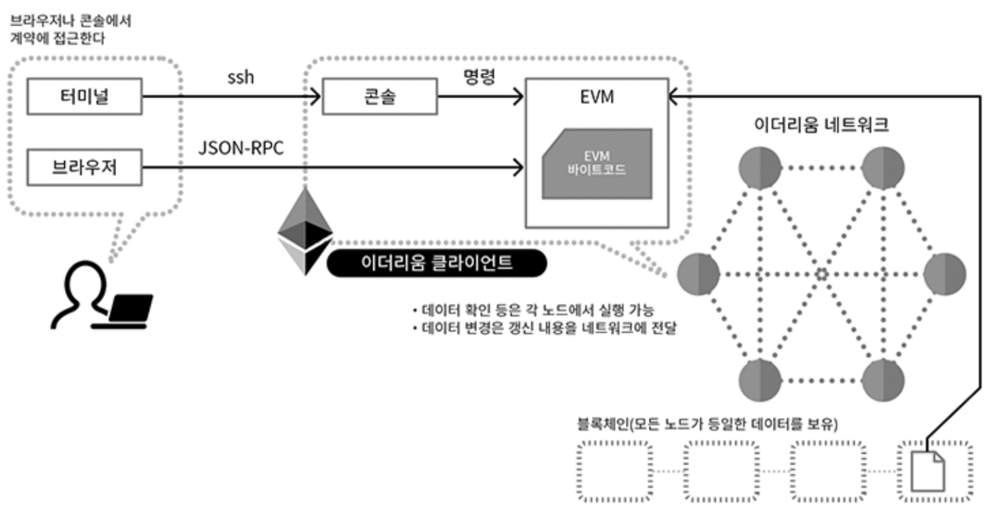

# Web3, Web3.js

## Web3

Web3란 사용자 중심의 인터넷으로, 모든 자료와 정보가 분산화된 차세대 네트워크 구조를 뜻한다.

중앙화된 데이터에는 개인정보의 해킹 위험성부터, 수집한 데이터의 판매까지 많은 리스크가 존재한다.

개인 사적인 정보는 물론 일상생활의 흔적까지도 플랫폼 호스트 서버에 보관이 되는 사례도 있었으며,

나도 모르는 사이에 다른 지역, 국가에서 악용되는 사례도 많이 발생하고 있다.

Web3에서는 탈중앙화된 블록체인 네트워크를 통해 서버가 없는 분산형 웹이 구현된다. 

Web3에서는 서버(중개인)없이 사용자들끼리 p2p가 가능해진다. 

핵심 아이디어는 데이터가 분산된 저장소에 보관되므로 현재와 같이 정해진 양의 서버 팜이 아니라 인터넷 전체에 분산된다는 것이다.

이 데이터가 이동하는 방식은 블록체인에 등록되어 데이터 흐름을 투명하게 만드는 동시에 오용을 방지한다.

 

---

 

## Web3.js

 

Web3.js는 이더리움 네트워크와 상호작용할 수 있는 다양한 메서드를 제공하는 자바스크립트 라이브러리이다.

이더리움 블록체인 네트워크를 사용한 Dapp을 만든다는 것은 다른 말로 하면 솔리디티 언어로 스마트 컨트랙트를 개발하는 것과, 

블록체인과 상호작용할 수 있는 클라이언트(노드)를 개발하는 것이다. 

이 때 후자를 위해서 사용하는 라이브러리가 Web3.js이다.

 

- 이더리움 블록체인을 사용하는 Dapp 개발 = `솔리디티로 스마트 컨트랙트 개발` + `블록체인과 상호작용할 수 있는 클라이언트 개발`
- 솔리디티로 스마트 컨트랙트 개발 = `블록체인 내에서 작동하는 프로그램`을 만드는 것.
- 블록체인과 상호작용하는 클라이언트 개발 = 스마트 컨트랙트 이용하고 트랜잭션 조회 및 생성 (`Web3.js` 사용)

 

블록체인 외부에 위치한 클라이언트가 블록체인 네트워크와 상호작용하기 위해 web3.js 모듈을 사용한다. 

이더리움 블록체인과 Web3.js는 JSON RPC를 통해서 통신한다. 

이더리움 블록체인은 여러 개의 노드로 구성된 P2P 네트워크이므로, Web3.js는 이중 하나의 노드에 연결되어 JSON RPC 통신을 구축한다. 

web3.js와 연결된 노드를 provider라고 한다.

 

 

> RPC = Remote Procedure Call, 별도의 원격 제어를 위한 코딩 없이 다른 주소 공간에서 함수나 프로시저를 실행할 수 있게하는 프로세스 간 통신 기술

 

JSON RPC라는 개념이 조금 어려운데, 일반적으로 서버와 클라이언트가 통신하는 것과 마찬가지로,

정규화된 양식에 맞춰 이더리움 블록체인에 있는 노드에게 요청을 보내면 노드는 이에 상응하는 응답을 뱉는다는 것이다. 

 

---

 

## Source 

 

[Web3란 무엇인가 ?](https://brunch.co.kr/@louiehwang/11)

