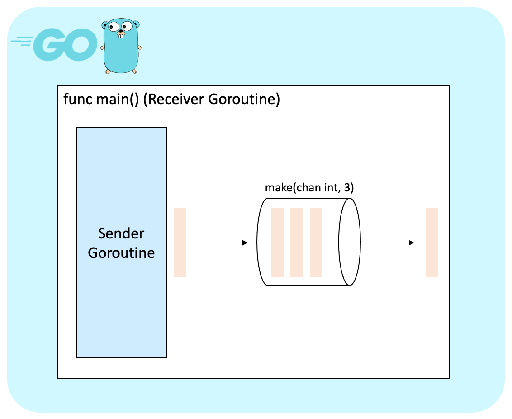

# Goroutine and Channel

<br />

Go언어의 특징 중 하나는 동시성이다. 

동시성이란 프로그램이 순차적인 흐름으로 수행되는 것이 아니라 동시에 수행되어 처리되는 것을 말한다. 

Go 언어는 이러한 동시성을 위해 고루틴(goroutine)과 채널(channel)이라는 키워드를 제공한다.

<br />

---

## Goroutine

<br />

Goroutine(고루틴) Go 런타임이 관리하는 Lightweight 논리적(혹은 가상의) 스레드이다. 

Go에서 go 키워드를 사용하여 함수를 호출하면 런타임시 새로운 고루틴을 생성한다.

고루틴은 비동기적으로 함수 루틴을 실행하므로, 여러 코드를 동시에(Concurrently) 실행하는데 사용된다.

`고루틴은 OS 스레드보다 훨씬 가볍게 비동기 Concurrent 처리를 구현하기 위하여 만든 것`으로, 기본적으로 Go 런타임이 자체 관리한다.

Go 런타임 상에서 관리되는 여러 고루틴들은 종종 하나의 OS 스레드로도 실행될 수 있다.

즉, 고루틴들은 OS 스레드와 1대1 대응되지 않고 Multiplexing으로 훨씬 적은 OS 스레드를 사용한다.

메모리 측면에서도 OS 스레드가 1메가바이트의 스택을 갖는 반면, 

고루틴은 이보다 훨씬 작은 몇 킬로바이트의 스택을 갖는다(필요 시 동적으로 증가).

go 라는 키워드를 붙여서 `호출하는 함수(A)`는 `현재 실행되고 있는 함수(B)`와 흐름이 구분되어 별개로 동작한다. 

여기서 호출하는 함수 A는 `동시성`을 가진다고 할 수 있으며, 

고루틴끼리의 의존관계가 없으므로 고루틴 함수의 실행 순서는 프로그램에 영향을 미치지 않는다.

즉 고루틴은 함수의 실행을 동시에 수행하고자 할 때 사용한다. 

<br />

### Goroutine 제어하기

<br />

흐름이 분리된 고루틴은 sync 패키지를 통해 제어해야 한다. 

sync 패키지는 mutual exclusion lock과 같은 동기화 기능을 제공한다. 

흔히 사용하는 sync.Once, sync.WaitGroup 의 경우 낮은 수준의 동기화를 수행하는데, 

높은 수준의 동기화를 위해서는 이후에 설명할 채널을 사용하는 것이 좋다고 공식문서에서 밝히고 있다.

<br />

> mutual exclusion lock : 상호 배제 잠금, 공유 불가능한 자원의 동시 사용을 피하기 위해 사용되는 알고리즘 

<br />

---

<br />

## Channel

<br />

채널은 데이터를 주고 받는 통로 역할을 하는 자료구조이다. 

채널에 데이터를 넣고 뽑아내는 형태로 사용하며 흔히 서로 다른 고루틴 사이에 통신을 위해 쓰인다. 

Go는 채널을 기본 자료형으로 제공하므로, 다른 패키지나 라이브러리 없이 사용 가능하다.

<br />

채널을 사용하기 위해서는 make 함수를 통해 미리 생성해야 하며, 

생성 시 chan 이라는 키워드와 함께 해당 채널에서 주고받을 자료형을 정의한다. 

<br />

```go
c1 := make(chan int) // 새 정수채널 c1
var chan int c2 = c1 // 새 채널 변수 c2에 c1를 할당
var chan<- int c3 = c1 // send 전용 채널 c3
var <-chan int c4 = c1 // receive 전용 채널 c4
```

<br />

채널은 내부에서 수신자와 송신자가 서로 기다리는 속성을 가진다. 

즉 송신 고루틴과 수신 고루틴이 동시에 보내고 받을 준비가 되어 있어야 올바르게 동작한다. 

이러한 문제를 해결하기 위해 Go는 채널 버퍼링 기능을 제공한다.

<br />

```go
package main

import "fmt"

func main() {
	c := make(chan int, 5) // 버퍼가 5인 정수형 채널 

	go func() {
		c <- 111
		c <- 222
		c <- 333
	}()

	i := <-c
	fmt.Println(i)
}
```

<br />

버퍼가 있는 채널은 채널에 버퍼 크기를 지정함으로써 버퍼가 가득차기 전까지는 수신 고루틴이 준비되지 않아도

송신 고루틴이 채널에 미리 데이터를 전송할 수 있다. 

따라서 송신 고루틴은 수신 고루틴의 준비여부와 상관없이 미리 전송하고 다른 일을 바로 수행할 수 있다.

그러나 버퍼가 있는 채널이 언제나 좋은 것은 아니다.

버퍼가 가득 찬 경우 송신 고루틴이 데이터를 전송한다면 에러가 발생하여 고루틴 동작이 멈춰버린다. 

경우에 따라서는 치명적인 문제로 이어질 수 있기 때문에,

처음에는 버퍼가 없는 채널로 최적화된 코드를 작성하되, 필요에 따라서 버퍼의 크기를 조절해주는 것이 좋다.

<br />



<br />

---

## Source

<br />

[<참조링크>](https://jbhs7014.tistory.com/179)

[<참조링크>](http://golang.site/go/article/21-Go-%EB%A3%A8%ED%8B%B4-goroutine)

<br />