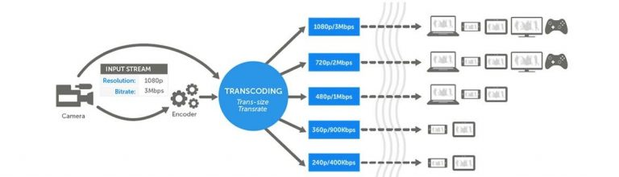
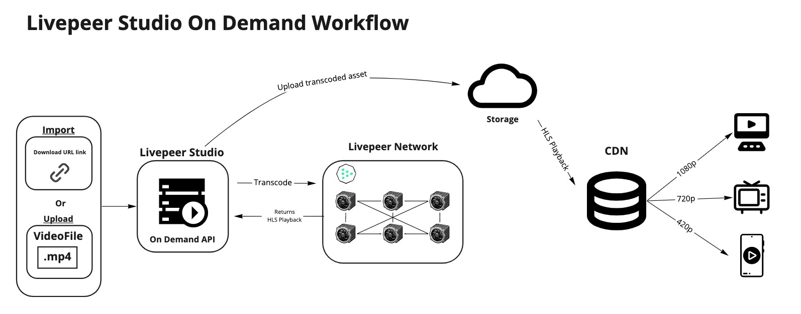
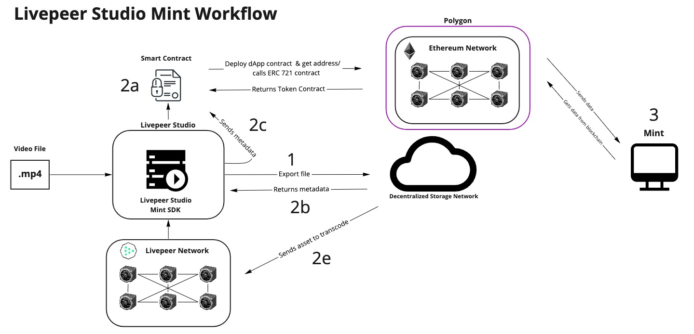

# Livepeer

컨텐츠 사업에서 비용 문제는 빼놓을 수 없는 문제이다. 

라이브피어는 스트리밍 비용을 줄일 수 있는 기술을 가지고 있는데, 라이브피어가 무엇이며

어떤 방식으로 비용을 줄일 수 있는지 알아보자. 

 

---

 

## CDN에 대해

 

CDN(컨텐츠 전송 네트워크)는 지리적으로 분산된 여러 개의 서버이다. 웹 컨텐츠를 사용자와 가까운 곳에서 전송함으로써 전송 속도를 높인다.

매일매일 폭발적으로 증가하는 데이터를 지연 없이 처리하기 위해서는 데이터를 분산해서 전달하는 기술이 필수적인데, 

지리적으로 먼 거리에 떨어져 있는 사용자에게 지연 없이 컨텐츠를 분산해 전달할 수 있는 CDN 서비스가 등장했다.

CDN은 각 지역에 캐시 서버를 분산 배치해, 근접한 사용자의 요청에 원본 서버가 아닌 캐시 서버(PoP, Points of presence)가 컨텐츠를 전달한다. 

예를 들어 미국에 있는 사용자가 한국에 호스팅 된 웹 사이트에 접근하는 경우, 미국에 위차한 PoP 서버에서 웹 사이트 컨텐츠를 사용자에게 전송하는 방식이다.

인터넷을 통해 비즈니스를 운영하거나 웹 사이트에서 그래픽 이미지, 동영상 파일 등의 컨텐츠를 제공한다면 CDN 서비스가 필요하다.

**특정 국가나 지연만을 타깃으로 하는 웹 서비스를 운영한다면 오히려 불필요한 연결 지점이 늘어나 웹 사이트의 성능 저하로 이어질 수 있다**

 

---

 

## RTMP/RTSP && HLS

 

> RTMP/RTSP : (Real Time Messaging Protocol/ Real Time Streaming Protocol)

> HLS : HTTP Live Streaming

 

우리가 스트리밍을 하게 되면 카메라가 촬영을 하게 되고, 이는 캡쳐 인터페이스를 통해 파일 생성으로 이어진다.

요즘은 카메라 자체적으로 바로 RTMP(Real Time Messaging Protocol) 신호와 같이 곧 바로 스트리밍 신호를 뽑아내는 기능을 가진 카메라도 있다. 

이럴 경우 중간 과정 없이 바로 파일이나 신호로 Output이 나오게 된다. 

신호형식이라는 표현을 사용한 이유는 서비스할 컨텐츠가 실시간인 경우에 해당한다. 

종류에 따라 HLS로 서비스 하는 경우 신호인 동시에 파일이기도 하다. 

HLS 기준으로 m3u8이라는 manifest file이 생성된다. 이 파일을 메모장으로 열어보면 몇 가지 태그와 함께

하위에 Chunk 파일 리스트가 보이게 된다. 즉, m3u8 파일은 그 내용이 계속 바뀌게 되고 Chunk라는 짧게 잘린 동영상 파일 목록이 갱신된다.

 

---

 

## Codec

 

코덱은 영상을 압축하기 위한 기술이다. 최대한 원본의 화질을 유지하면서 저용량 고화질의 서비스를 위해 영상을 압축하는 S/W이다.

코덱에는 여러 종류가 있고, 무료인 것이 있고 유료인 것이 있으며, 호환성도 따져봐야 함으로 잘 알아보고 사용하면 된다고 한다.

 

---

 

## Encoding vs Transcoding

 

인코딩은 압축 과정 자체를 의미한다. 예를 들어 압축되지 않은 무압축 영상을 코덱을 이용하여 압축하는 작업을 의미한다. 

카메라에서 촬영하면서 저장된 무압축 mp4 파일을 코덱을 통해 HD, FHD 등으로 해상도를 줄이면서 압축하는 작업이다. 

이 과정에서 중요한 점은 바로 어느 정도의 손실을 감수하고 화질을 줄일지 결정하는 부분이다. 

사실상 플랫폼 서비스를 위해서 인코딩과 동시에 트랜스코딩이 진행된다.

트랜스코딩은 영상 소스가 다른 형식으로 변환됨을 의미한다. 

 

 

주로 이 부분은 현업에서 RTMP가 원본인 영상을 고객에게 화질별로 서비스하기 위해서 SD, HD, FHD 이렇게 세 가지로 인코딩이 되고,

원본 1개가 각 화질로 서비스 파일이 인코딩 되는 동시에 DRM이 패키징된 다른 형식의 파일로 트랜스코딩하게 된다. 

AWS 이외 다른 솔루션들에서도 마찬가지로 변환되어 출력되는 결과물의 분당 과금으로 요금을 책정한다. 

물론 Live Streaming의 경우 input과 output 둘 다를 과금하는 형태도 있다. 

이 때 조심해야 하는 부분은 컨텐츠 변환 비용을 예측하기 위해 단순히 몇 분에 얼마라는 식으로 계산하면 안된다. 

어떠한 화질로 어떤 환경에서 어떤 디바이스에 서비스 할 지를 고려해야 한다. 

 

### 인코딩과 트랜스코딩의 차이

 

원본 영상파일 또는 신호를 1차적으로 인코딩을 통해 화질별로 압축하는 동시에 서비스 스펙에 맞는 파일 형태로 트랜스코딩 한다고 생각하면 된다. 

 

**인코딩** : 압축과정

**트랜스코딩** : 변환과정

> DRM : Digital Rights Management

 

---

 

## Livepeer is 

 

Livepeer는 이더리움 블록체인에 구축된 탈중앙화 비디오 코드 변환 네트워크이다.

완전히 탈중앙화되고 확장성이 높으며 암호화 토큰 인센티브가 있는 라이브 비디오 스트리밍 네트워크 프로토콜을 제공한다.

결과적으로 탈중앙화 개발 (Web3) 스택에서 라이브 미디어 계층 역할을 할 수 있는 솔루션을 제공한다. 

 

---

 

## 어떻게 동작하는가? 

 

비디오 개발의 기본 원칙은 원본 비디오를 인코딩 도구로 압축해서 전송 및 변경을 위한 파일 크기를 줄이는 것.

인코딩된 비디오는 이제 다른 변환으로 트랜스코딩되어야 한다. 

전통적인 웹에서는 중앙화된 서버에서 트랜스코딩이 이루어진다. 

라이브피어는 비디오 및 라이브스트림 데이터를 가져와 라이브피어 네트워크에서 트랜스코딩을 한다.

라이브피어 네트워크는 비디오 배포를 관리하는데, 개별 컴퓨터와 노드 역할을 하는 사용자로 구성된 개방형 네트워크이다.

여기서 노드마다 목적과 기능이 다른데, 네 가지 주요 노드 유형이 있다. 

[오케스트레이터와 딜리게이터](https://livepeer.org/ko/primer)

*   브로드캐스터 : 스트림을 시작하고 녹화 파일을 관리하는 사용자. (애플리케이션을 이용해 방송 및 미디어 활동을 하는 사용자)
*   트랜스코더 : 트랜스코딩 노드 역할을 하는 사용자. 실제로 트랜스코딩을 해주는 역할을 담당. (Orchestrator)
*   중계기 : 트랜스코더에서 소비자로 전달하는 중개자 노드. (Orchestrator)
*   소비자 : 스트림을 소비하거나 스트림을 추가로 배포하는 최종 사용자. (프로젝트에 라이브피어를 사용하는 개발자)

오케스트레이터는 자신의 컴퓨터 리소스를 기여하여 비디오의 트랜스코딩 및 배포를 수행한다. 그리고 이 대가로 암호화폐를 수수료로 획득한다.

 

---

 

### Why Livepeer? 

 

동영상은 스트리밍 비용이 막대하고, 그것이 라이브 스트리밍인 경우 훨씬 더 많은 비용이 들게 된다. 

동영상을 배포하는 측(Broadcaster)는 먼저 동영상을 변환(인코딩 + 트랜스코딩)해야 하기 때문이다. 

코드 변환은 2G 또는 5G이든 사용자가 사용하는 대역폭이나 기기에 상관 없이 최적의 시청 환경을 제공할 수 있도록 

`원시 파일을 받아서 코드 서식을 다시 지정하는 작업`이다.

[AWS](https://aws.amazon.com/ko/medialive/pricing/)에서는 미디어 서버 한 대당 매월 최대 $4500, 컨텐츠 제공 네트워크의 경우 매월 최대 $1500의 비용이 소요된다고 한다.

이러한 스트리밍 비용은 성공적인 비즈니스 모델에 악영향을 끼칠 수 있으며, 감당하기 위해 원치 않는 수많은 광고를 내보낼 수 밖에 없다.

Livepeer는 이러한 문제를 해결하기 위해 등장한 서비스 플랫폼으로써, 

이더리움 블록체인에서 보호되는 마켓플레이스를 통해 상호 작용하는 P2P 인프라를 구축하고 있다. 

본래의 방식이라면, 우리는 직접 인코딩과 트랜스코딩을 위한 작업을 거쳐야하고, 

이에 대한 input과 output에 상응하는 비용을 지불해야한다. 

또한 기존 인프라가 중앙 집중화되고 오프체인으로 구축되어 있기 때문에, 

블록체인 프로젝트는 이러한 트랜스코딩 서비스를 애플리케이션에 통합하기 어려운 점이 있다. 

Livepeer는 탈중앙화되어있고, 오픈 소스이며 ETH 블록체인을 기반으로 하므로, 모든 ETH 프로젝트에서 

Livepeer 및 비디오 스트리밍을 쉽게 통합할 수 있다. 

 

---

 

# Livepeer Studio Workflow

 

## Livestream Workflow

 

 

## Multistream Workflow

 

 

## On-Demand Workflow

 

 

## Mint Workflow

 

 

## Source

[CDN이란 무엇인가?](https://www.akamai.com/ko/our-thinking/cdn/what-is-a-cdn)

[CDN](https://library.gabia.com/contents/infrahosting/8985/)

[영상 인코딩과 트랜스코딩](https://www.lonelyplanit.com/6)

[라이브피어](https://livepeer.org/ko/primer)

[LINE의 트랜스코딩](https://engineering.linecorp.com/ko/blog/line-transcoding-server-architecture-improvement-1/)