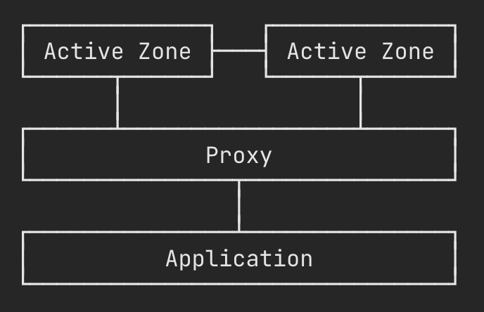

# Multi-Master Replication

 

Multi-Master-Replication(다중 마스터 복제)는 데이터를 컴퓨터 그룹에 저장하고,

그룹 구성원이 업데이트 할 수 있도록 하는 데이터베이스 복제 방법이다. 

다중 마스터는 각 구성원이 수정한 데이터를 나머지 그룹에 전파하고 

다른 구성원이 동시에 수행한 변경 간에 발생할 수 있는 충돌을 해결하는 역할을 한다. 

기존의 스케일링 방식과는 다르게 active 노드를 다중으로 사용하는 방식이다.

이러한 방식을 사용하면 기존의 single-master 상황과는 별개로 데이터가 각각의 노드에 쌓이기 때문에

수평적 확장이 쉬워지고 데이터의 액세스가 한 서버 내에서만 이루어지지 않으므로 IO 로드 또한 분산시킬 수 있다. 

 

 

애플리케이션이 얼마나 커질지 모르기 때문에 모든 노드끼리 서로 완전히 동기화를 보장하는 것 보다는

각각의 노드에서 데이터를 서로 분담하는 것이 유리하다.

## [Source](https://seia.io/stories/the-huge-messaging-platform/)